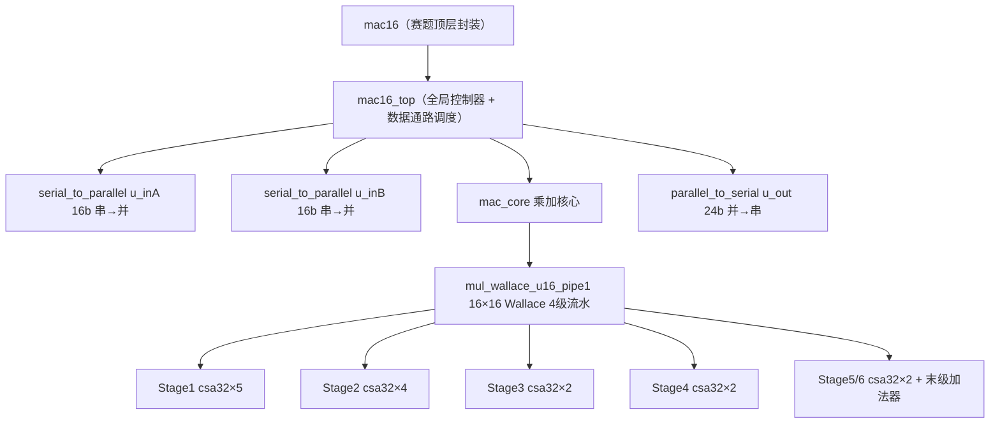
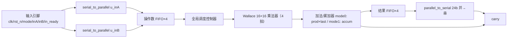

# MAC16 串行乘累加器芯片设计工程

本工程对应《工程任务和论文.pdf》：基于全流程国产数字 EDA 系统，完成 55nm、输入 16 位、输出 24 位的串行乘累加运算器 MAC16 芯片的 RTL 设计、仿真、逻辑综合、形式验证与后端全流程。

## 一、项目目标（摘自任务书）

- 串行输入 `inA` / `inB`（16b，MSB 先入，1Gbps），由 `clk`（1GHz）上升沿采样。
- 串行输出 `sum_out`（24b，MSB 先出），`out_ready` 同步；无输出时回 0。
- `carry` 为溢出粘滞位，置 1 后可被 `rst_n` 或 `mode` 切换清除。
- `mode=0`：输出当前乘积 + 上一状态乘积；`mode=1`：全部状态乘积累加；`mode` 切换时清空内部状态。
- 指标：`Total Power ≤ 300uW`（挑战 ≤ 100uW）、3 个 PVT corner 在 1GHz 下 setup/hold 均通过、总面积 ≤ 90um×90um、金属层 ≤ 5 层（M1~M4 & TM2）。

## 二、目录结构

```
mac16/
├── 工程任务和论文.pdf     # 任务书 + Chiplet/DSE 论文调研资料
├── README.md             # 本文件
├── design/               # 核心 RTL 代码（8 个模块，见下表）
├── testbench/            # 赛题验收 testbench（3 种 mode 组合自动比对）
├── script/               # VCS 仿真 Makefile / DC 综合脚本 / Formality 脚本 / SDC
├── lib/                  # 浙江创芯 ics55 标准单元库（7 个 PVT corner：.db + .lib.gz + PDK GDS/LEF/CDL/TF）
├── out/
│   ├── sim/              # VCS 仿真产物（simv 等）
│   ├── syn/              # DC 综合结果（网表/SDF/SDC/时序/功耗/面积报告）
│   ├── apr/              # FC 布局布线结果（GDS/网表/SDF/SPEF/报告/工艺文件）
│   └── lvs/              # IC Validator LVS 验证（规则 + 单单元验证 PASS 结果）
├── host_setup/           # 宿主机/多机 Git 配置脚本（Windows PowerShell + Unix shell）
├── wave/                 # 仿真波形（mac16.vpd）
└── docs/                 # 模块图（PNG/SVG + DOT 源文件）
```

> 说明：标准单元库原始 `.lib`（约 113MB/个）超过 GitHub 单文件 100MB 上限，
> 已压缩为 `.lib.gz` 入库（工具直接用 `.db` 即可；如需 `.lib` 解压即可）。

## 三、核心 RTL 模块

| 模块 | 文件 | 功能 |
| --- | --- | --- |
| `mac16` | [design/mac16/mac16.v](design/mac16/mac16.v) | 赛题顶层封装，仅暴露题目定义引脚 |
| `mac16_top` | [design/mac16_top/mac16_top.v](design/mac16_top/mac16_top.v) | 全局调度控制器 + FIFO 数据通路 |
| `serial_to_parallel` | [design/serial_to_parallel/serial_to_parallel.v](design/serial_to_parallel/serial_to_parallel.v) | 16b 串→并（MSB 先入），×2 实例 |
| `mac_core` | [design/mac_core/mac_core.v](design/mac_core/mac_core.v) | 乘加核心（mode 0/1、累加、溢出） |
| `mul_wallace_u16_pipe1` | [design/mul_wallace_u16_pipe1/mul_wallace_u16_pipe1.v](design/mul_wallace_u16_pipe1/mul_wallace_u16_pipe1.v) | 16×16 Wallace 树乘法器，4 级流水 |
| `csa32` | [design/csa32/csa32.v](design/csa32/csa32.v) | 32b 进位保留加法器，乘法器内 15 实例 |
| `fulladder` | [design/fulladder/fulladder.v](design/fulladder/fulladder.v) | 1bit 全加器，csa32 内 32 实例（共 480） |
| `parallel_to_serial` | [design/parallel_to_serial/parallel_to_serial.v](design/parallel_to_serial/parallel_to_serial.v) | 24b 并→串（MSB 先出） |

## 四、模块结构图

### 4.1 模块层次图



高清图：[module_hierarchy.png](docs/images/module_hierarchy.png)（[SVG](docs/images/module_hierarchy.svg)，[DOT 源文件](docs/module_hierarchy.dot)）

### 4.2 数据通路图



高清图：[datapath.png](docs/images/datapath.png)（[SVG](docs/images/datapath.svg)，[DOT 源文件](docs/datapath.dot)）

## 五、工程现状（依据现有日志/报告）

| 项目 | 结果 |
| --- | --- |
| 前仿真（3 种 mode 组合，18 组数据） | `Simulation Passed`（见 [script/sim.log](script/sim.log)） |
| 逻辑综合（SS/1.08V/125℃/RCWorst） | 完成，无违例（见 [script/syn.log](script/syn.log)、[out/syn](out/syn)） |
| Total Power | 0.266 mW = 266 µW（≤ 300µW 达标；≤ 100µW 待优化） |
| 综合后面积 | 总 cell 面积 11501.64（[area.rpt](out/syn/area.rpt)） |
| 时序 | setup slack MET（0.00）、hold slack MET（0.01~0.04） |
| 形式验证 | Formality 流程与报告位于 [script](script)（fm*.log / formality*.log） |

### 布局布线（Fusion Compiler）状态

- 脚本：[fc_apr.tcl](script/fc_apr.tcl)（NDM 建库（ics55.tf + LEF）→ 布线层 M1~M4+TM2 → 144um die/134um core → PG → place/CTS/route → 报告与 GDS/SPEF 输出，幂等可重跑）
- 运行日志：[out/apr/fc_apr.log](out/apr/fc_apr.log)，验证报告：[out/apr/fc_apr_report.md](out/apr/fc_apr_report.md)
- **当前状态：P&R 已完整跑通（0 Error）**。1GHz 下 Setup WNS -0.01ns/TNS -0.04ns（12 条违例）、Hold 1 条 -0.00ns；Cell area 11171µm²；总功耗 720µW；Net DRC 1 条。与赛题指标差距见 [fc_apr_report.md](out/apr/fc_apr_report.md)（功耗/面积超指标、需 3 corner 与 LVS/DRC）。
- 入库范围：`out/apr/` 下的报告、日志、GDS、网表、SDF、SPEF 与 `tech/` 工艺/寄生文件全部入库；`ndm/`、`CLIBs/`（约 29MB，可由脚本自动重建）及 FC 会话临时文件不入库（见 .gitignore）。

### 物理验证（IC Validator LVS）状态

- 单元级验证：[out/lvs](out/lvs)（`ics55_lvs.rs` + `invx.gds`/`invx.cdl`，PASS）
- **整芯片验证：[out/lvs/chip](out/lvs/chip)（`mac16_merged.gds` vs `mac16_lvs.cdl`，PASS）**
  - 35155/35155 器件匹配（NMOS 17567 + PMOS 17588），网络/端口全部匹配
  - 流程：`merge_gds.py` 合并 GDS（APR 0.1nm/DB + PDK 单元 ×10）→
    `gen_schematic.py` 展平网表（含时钟门控 + CDL）→ `ics55_chip_lvs.rs` 抽取比较
- 本次验证发现并修复了两个真实问题：
  1. FC 流程缺电源网格/单元轨连接（VDD/VSS 开路）——已给 [fc_apr.tcl](script/fc_apr.tcl)
     增加 `create_pg_mesh_pattern` + `create_pg_std_cell_conn_pattern` 后重跑，电源成网；
  2. 综合网表中未使用的 DFF Q 引脚悬空——原理图生成改为保留悬空节点（不接 VSS）。
- 详细说明见 [out/lvs/chip/README.md](out/lvs/chip/README.md)。

### 三 PVT corner SPEF 与多角时序

- **3 个 corner 的 SPEF 已生成**：[out/apr](out/apr)（`mac16_apr.spef.ics55_{typ,rcworst,rcbest}*.spef`），
  由 PDK RCE ETF 转 ITF → StarRC 生成 TLU+ → FC 多角提取。
- 1GHz 时序：TYP **MET(+0.06)**、FF/RCbest **MET(+0.36)**、**SS/RCworst/1.08V/125°C 违例(-0.76ns)**。
- 流程与结果详见 [out/apr/3corner_spef_README.md](out/apr/3corner_spef_README.md)。

## 六、流程复现

```bash
# 1. 前仿真（VCS）
cd script && make sim        # 需先设置 VCS 环境

# 2. 逻辑综合（DC）
cd script && dc_shell -f dc_syn.tcl | tee syn.log

# 3. 形式验证（Formality）
cd script && fm_shell -f fm_mac16.tcl | tee fm.log

# 4. 布局布线（FC，本地目录运行，幂等）
cd script && fc_shell -batch -f fc_apr.tcl

# 5. 单元级 LVS（IC Validator，务必在本机磁盘运行，勿用共享目录）
cd /home/user/mac16_lvs_final
icv ics55_lvs.rs -i invx.gds -s invx.cdl -sf SPICE
```

> 注意：`lib/` 为标准单元库（ics55），`out/`、`wave/` 等为 EDA 工具产物，属任务书要求的“各阶段全部设计数据”，请勿随意删除。
> 仓库内不包含 EDA 会话缓存（`FM_WORK*`、`run_details/`、`ndm/`、`CLIBs/`、`*.svf`、`*.lck` 等，见 .gitignore）。
